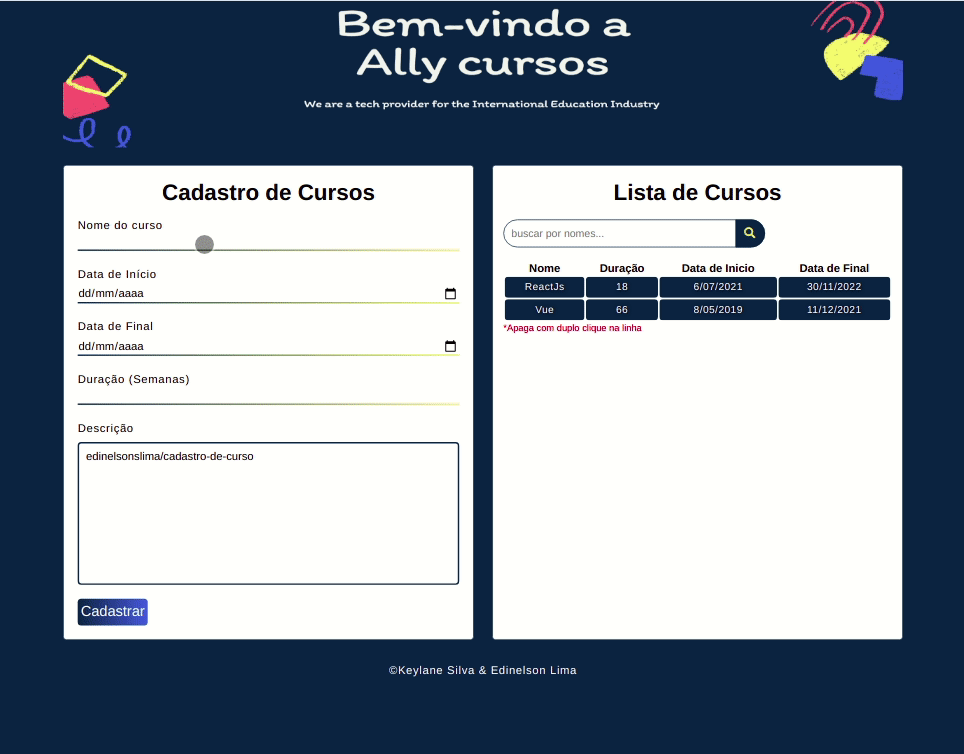

<h1 align="center"> Gerenciamento de Curso </h1>

**Desenvolvido em parceria com <a href="https://github.com/KeylaneSilva" target="_blank">Keylane Silva</a>**

 

<h2 align="center"> Principais tecnologias usadas </h2>

  
  
  

### O que faz?
* Cadastra cursos
* Salva em local storage
* Pesquisa dinâmica
* Possibilidade de apagar

 

### O que foi usado aqui?

* Local storage do JavaScript
* DOM do JavaScript
* Flex-box do css3
* HTML5
